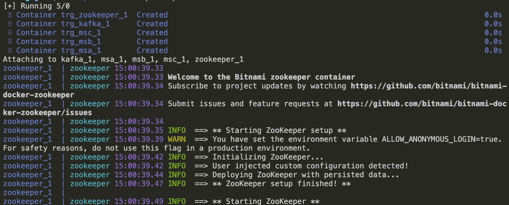
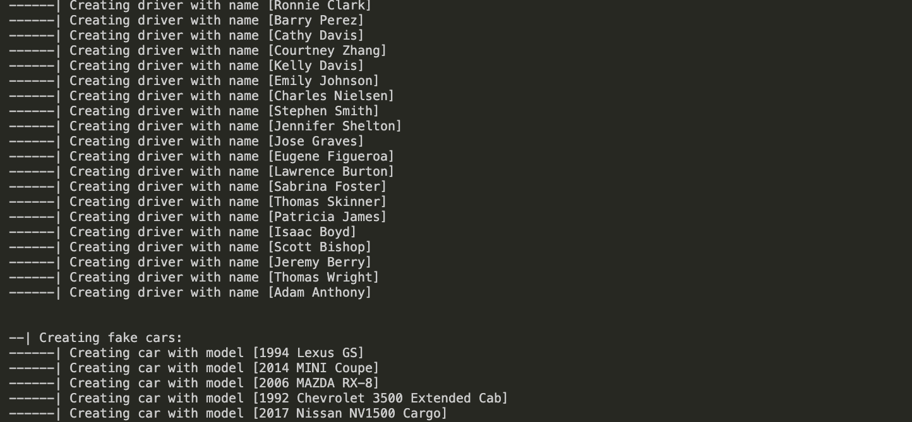
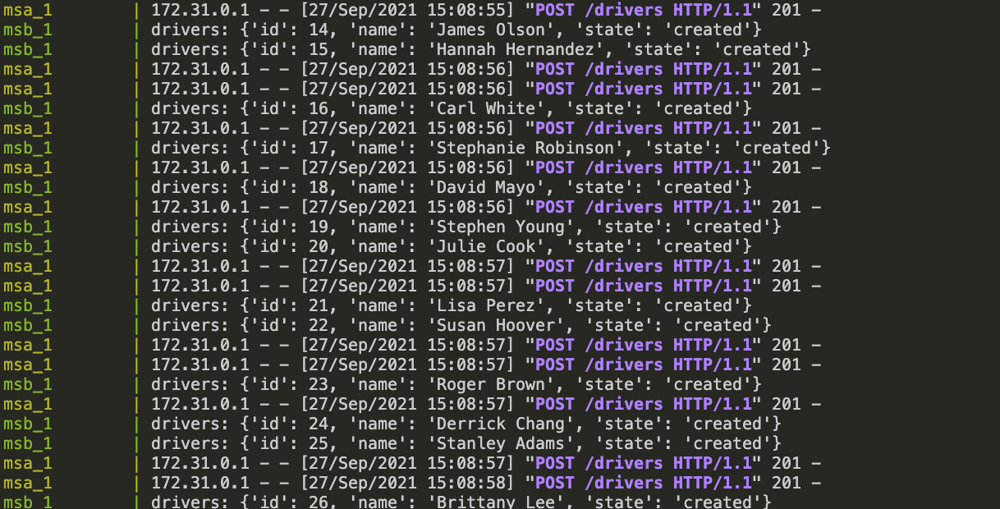
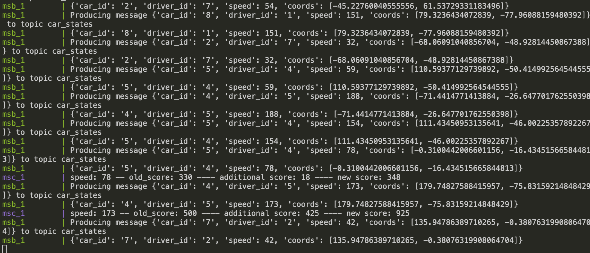
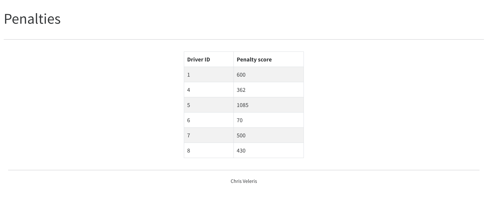

# Fleet Management System (FMS) :truck: :car: 


## Table of Contents 
1. [ Introduction ](#intro)
2. [ Architecture & features ](#archi) 
3. [ Screenshots ](#screenshots) 
4. [ Challenges ](#challenges)  
5. [ Future improvements ](#improvements) 
6. [ Installation ](#installation) 
7. [ Apache Kafka setup ](#apachekafka) 
8. [ Manual testing ](#testing) 
9. [ Part 2 - Open Policy Agent (OPA) ](#opa) 
10. [ Simple OPA Implementation ](#opaexample)

----------------------------------------------------------------------------------------
<a name="intro"></a>
## Introduction

**Part A:** Develop 3 microservices (using Python) for a fictitious Fleet Management System (FMS)  
**Part B:** Extend FMS with OPA (Open Policy Agent)

----------------------------------------------------------------------------------------
<a name="archi"></a>
## Architecture & features
### General
- **DOCKER:** The stack includes four containers
  - Microservice A (**MSA**): HTTP API CRUD
    - Python packages:
      - Flask
      - Flask_RESTful
      - kafka_python 
    - The service uses lists initialized in `data.py` as a storage solution
  - Microservice B (**MSB**): Driving simulation
    - Python packages:
      - kafka_python
  - Microservice C (**MSC**): Penalty assignment
    - Python packages: 
      - Flask
      - Flask_RESTful
      - kafka_python 
      - tinydb
    - Car <=> Driver penalty records NoSQL storage: [TinyDB](https://tinydb.readthedocs.io/en/latest/)
  - **Apache Kafka:** Main messaging service bus
    - Single cluster
    - No grouping used 
    - One topic per entity, including the action (created/updated/deleted)
    - A topic produced by MSB sending simulated driving states in order to be consumed by MSC and calculate penalties 
  - **Zookeeper**
- **DATA PREPOPULATOR:** A topics creator and fixtures seed prepopulator is also included: `prepopulate_data.py`. The prepopulator:
  - Cleans up the TinyDB of stored penalties
  - Creates Kafka topics
  - Creates fake data for all entities
  - Python packages 
    - Faker
    - faker_vehicle
- **TESTS:** There is also partial **test coverage** included 

### Kafka 
- Topics 
  - cars 
  - drivers 
  - trips 
  - car_drivers
  - car_states

----------------------------------------------------------------------------------------
<a name="screenshots"></a>
## Screenshots 
#### Docker starting


#### Prepopulator running


#### Objects being created, events are produced (MSA -> Kafka -> MSB)


#### Simulator running, events are produced (MSB) then consumed (MSB), penalties calculated (MSC)


#### Penalty Web 


----------------------------------------------------------------------------------------
<a name="challenges"></a>
## Challenges

- [**FIXED**] Kafka takes about 20 seconds to spin up. There is no health check in the beginning of each of the microservices, so as they create threads and try to consume/produce, they hang. A workroung was to add a `time.sleep(20)` before 
- [**FIXED**] Slow/Buffered `print()` with python threads library 
https://stackoverflow.com/questions/18234469/python-multithreaded-print-statements-delayed-until-all-threads-complete-executi
- [**FIXED**] Mocking `KafkaProducer.send` in tests

----------------------------------------------------------------------------------------
<a name="improvements"></a>
## Future improvements 
- [ ] Better test coverage 
- [ ] Add timestamp to messages 
- [ ] Improve logging 
- [ ] Add arguments for specific topics and actions to `prepopulate_data.py`
- [ ] Setup Kafka replication, groupID, cluster
- [ ] Add keys to Kafka messages for partitioning 
- [ ] Params validation 
- [ ] Move topics creation from `prepopulator` to `kafka_python` 

----------------------------------------------------------------------------------------
<a name="installation"></a>
## Installation & setup

```
git clone <repo>

docker-compose build 
docker-compose up 

python prepopulate_data.py
```

To run tests, execute in the root directory of each service:

```
pytest -v --disable-warnings            # in order to disable deprecation warnings 
```

----------------------------------------------------------------------------------------
<a name="apachekafka"></a>
## Apache Kafka setup
The commands listed below are just mentioned as a reference and also for quick debugging of issues. There is no reason to run them separately. 
### Get list of topics 
```
docker-compose exec kafka kafka-topics.sh --bootstrap-server localhost:9092 --list
```
### Create topic 
> ! WARNING: This happens automatically by running the prepopulate_data.py script once !

```
docker-compose exec kafka kafka-topics.sh --create --bootstrap-server localhost:9092 --replication-factor 1 --partitions 3  --topic drivers
docker-compose exec kafka kafka-topics.sh --create --bootstrap-server localhost:9092 --replication-factor 1 --partitions 3  --topic cars
docker-compose exec kafka kafka-topics.sh --create --bootstrap-server localhost:9092 --replication-factor 1 --partitions 3  --topic trips
docker-compose exec kafka kafka-topics.sh --create --bootstrap-server localhost:9092 --replication-factor 1 --partitions 3  --topic car_drivers
docker-compose exec kafka kafka-topics.sh --create --bootstrap-server localhost:9092 --replication-factor 1 --partitions 3  --topic car_states
```

#### Produce events to topic 
```
docker-compose exec kafka kafka-console-producer.sh --topic drivers --bootstrap-server localhost:9092
```

#### Consume events from topic
```
docker-compose exec kafka kafka-console-consumer.sh --topic drivers --from-beginning --bootstrap-server localhost:9092
```

##### Resources 
- https://www.linkedin.com/pulse/local-kafka-setup-using-docker-sandeep-khurana/
- https://github.com/bitnami/bitnami-docker-kafka
----------------------------------------------------------------------------------------
<a name="testing"></a>
## Manual testing
### MSA 
#### Drivers
- curl http://127.0.0.1:5000/drivers
- curl http://127.0.0.1:5000/drivers/1
- curl -X POST http://127.0.0.1:5000/drivers -d "name=Michael Jackson"
- curl -X PUT http://127.0.0.1:5000/drivers/1 -d "name=Frank Sinatra"
- curl -X DELETE http://127.0.0.1:5000/drivers/1

#### Cars 
- curl http://127.0.0.1:5000/cars
- curl http://127.0.0.1:5000/cars/1
- curl -X POST http://127.0.0.1:5000/cars -d "model=2019 Suzuki Swift"
- curl -X PUT http://127.0.0.1:5000/cars/1 -d "model=2047 Suzuki Swift"
- curl -X DELETE http://127.0.0.1:5000/cars/1
#### Trips 
- curl http://127.0.0.1:5000/trips
- curl http://127.0.0.1:5000/trips/1
- curl -X POST http://127.0.0.1:5000/trips -d "from_location=Iowa&to_location=Texas"
- curl -X PUT http://127.0.0.1:5000/trips/1 -d "from_location=Athens&to_location=Patra"
- curl -X DELETE http://127.0.0.1:5000/trips/1
#### Car <=> Drivers
- curl http://127.0.0.1:5000/car_drivers
- curl http://127.0.0.1:5000/car_drivers/1
- curl -X POST http://127.0.0.1:5000/car_drivers -d "car_id=1234&driver_id=5678"
- curl -X PUT http://127.0.0.1:5000/car_drivers/1 -d "car_id=4321&driver_id=8765"
- curl -X DELETE http://127.0.0.1:5000/car_drivers/1

### MSC 

Once the containers are up, an HTML page with a bootstrap table is visible in http://localhost:5001/penalties. The page reflects the NoSQL data and does not auto-refresh.

----------------------------------------------------------------------------------------

<a name="opa"></a>
## Part 2 - Open Policy Agent (OPA)
### Requirements
####  Where can OPA be a good fit for the fictitious FMS in Part A ?
  - HTTP REST API Role-based Access Control 
    - All users can view (GET) their driver records
    - User Bob is an **superadmin** and has GET/POST/PUT/DELETE acccess to drivers, cars, trips and driver-to-car assignement records 
    - User John is a **simple member** (driver) and has access to view (GET) his records or update them (PUT) but not to remove them (DELETE). 
    - User Kate is a **fleet manager** and can manage (PUT/DELETE) car records    
  - Defy and Enforce an authorization policy over **Apache Kafka** topics ([1][1])
    - Restrict consumer access to topics containing Sensitive Information (e.g. the car state containing the exact geo point and the speed of the car)
  
  The _OPA ecosystem_ has lots of integrations to offer ([2][2]).
#### Benefits of OPA
  - **Centralized, language-agnostic authorization**. OPA defies the need to multiply an already complex area. 
  - Makes easy to **mitigate security incidents** by enforcing changes quickly across the entire stack
  - Real world policies can be encoded in a **natural, easy to read language**. This is very important because of the wide stakeholder range that are responsible for writing, editing and reviewing policies: software engineers, security engineers, ops, compliance managers, product owners. The list is endless. 
#### OPA potential residence in the FMS architecture
  - HTTP REST API Role-based Access Control:
    The OPA can reside in the MSA system as a sidecar.  
  - Kafka authorization policy enforcer
    _docker-compose_ can spin up an OPA container and connect to Kafka via SSL. 

----------------------------------------------------------------------------------------

<a name="opaexample"></a>
10. Simple OPA implementation 

> !! The OPA implementation has been pushed to the `feature/opa` branch. !!

In order to experiment with OPA, a container has been added to `docker-compose.yml`:

```
opa:
  hostname: opa
  image: openpolicyagent/opa:0.32.1
  ports:
    - 8181:8181
  command: "run --server --watch /policies"
  volumes:
    - ./policies:/policies
```

and a policy in `./policies/cars.rego`.

The service is available at http://localhost:8181 

In order to verify the policy:

```
allow {
	input.method = "GET"
	input.path = ["cars"]
  has_role("car_admin")
}

employees = {
	"alice": {"roles": {"manager", "car_admin"}},
	"james": {"roles": {"manager"}},
	"kelly": {"roles": {"car_admin"}},
}
```
we make some requests: 
- GET request to `/cars` (`curl http://localhost:5000/cars)`:
```
{
    "message": "You don't have the permission to access the requested resource. It is either read-protected or not readable by the server."
}
```
- GET request to `/cars` as _alice_  (`curl http://localhost:5000/cars -H 'Authorization: alice'`):

```
[
    {
        "id": "1",
        "model": "Toyota Corolla E12"
    },
    {
        "id": "2",
        "model": "Honda Civic 2019"
    },
    {
        "id": "3",
        "model": "Nissan Navaro GT"
    }
]
```

[1]: https://www.openpolicyagent.org/docs/latest/kafka-authorization "Kafka"
[2]: https://www.openpolicyagent.org/docs/latest/ecosystem/ "OPA Ecosystem"
